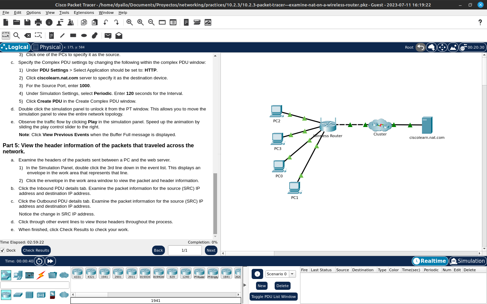

# Examine nat on a wireless router

Packet Tracer - Examine NAT on a Wireless Router

Objectives
·         Examine NAT configuration on a wireless router

·         Set up 4 PCs to connect to a wireless router using DHCP

·         Examine traffic that crosses the network using NAT

Instructions
Part 1: Examine the configuration for accessing external network.
a.     Add 1 PC and connect it to the wireless router with a straight-through cable. Wait for all link lights to turn green before moving onto the next step or click Fast Forward.

b.     On the PC, click Desktop. Select IP Configuration. Click DHCP to enable each device to receive an IP address via the DHCP on the wireless router.

c.     Note the IP address of the default gateway. Close the IP Configuration when done.

d.     Navigate to the web browser and enter the IP address of the default gateway in the URL field. Enter the username admin and password admin when prompted.

e.     Click Status menu option in the upper right-hand corner. When selected, it displays the Router sub-menu page.

f.      Scroll down the router page to the Internet connection option. The IP address assigned here is the address assigned by the ISP. If no IP address is present (0.0.0.0 appears), close the window, wait for a few seconds and try again. The wireless router is in the process of obtaining an IP address from the ISP DHCP server.

The address seen here is the address assigned to the Internet port on the wireless router.

Question:
Is this a private or public address?

Part 2: Examine the configurations for accessing the internal network.
a.     Click Local Network within the Status sub-menu bar.

b.     Scroll down to examine the Local Network information. This is the address assigned to the internal network.

c.     Scroll down further to examine the DHCP server information, and range of IP addresses that can be assigned to connected hosts.

Question:
Are these private or public addresses?

d.     Close the wireless router configuration window.

Part 3: Connect 3 PCs to the wireless router.
a.     Add 3 more PCs and connect them to the wireless router with straight-through cables. Wait for all link lights to turn green before moving onto the next step or click Fast Forward.

b.     On each PC, click Desktop. Select IP Configuration. Click DHCP to enable each device to receive an IP address via the DHCP on the wireless router. Close the IP Configuration when done.

c.     Click Command Prompt to verify each device IP configuration using ipconfig /all command.

Note: These devices will receive a private address. Private addresses are not able to cross the Internet, therefore, NAT translation must occur.

Part 4: View NAT translation across the wireless router.
a.     Enter Simulation mode by clicking the Simulation tab in the lower right-hand corner. The Simulation tab is located next to the Realtime tab and has a stopwatch symbol.

b.     View traffic by creating a Complex PDU in Simulation mode:

1)    From the Simulation Panel, click Show All/None to change visible events to none. Now click Edit Filters and under the Misc tab checkmark the boxes for TCP and HTTP. Close the window when done.

2)    Add a Complex PDU by clicking on the opened envelope located in upper menu.

3)    Click one of the PCs to specify it as the source.

c.     Specify the Complex PDU settings by changing the following within the complex PDU window:

1)    Under PDU Settings > Select Application should be set to: HTTP.

2)    Click ciscolearn.nat.com server to specify it as the destination device.

3)    For the Source Port, enter 1000.

4)    Under Simulation Settings, select Periodic. Enter 120 seconds for the Interval.

5)    Click Create PDU in the Create Complex PDU window.

d.     Double click the simulation panel to unlock it from the PT window. This allows you to move the simulation panel to view the entire network topology.

e.     Observe the traffic flow by clicking Play in the simulation panel. Speed up the animation by sliding the play control slider to the right.

Note: Click View Previous Events when the Buffer Full message is displayed.

Part 5: View the header information of the packets that traveled across the network.
a.     Examine the headers of the packets sent between a PC and the web server.

1)    In the Simulation Panel, double click the 3rd line down in the event list. This displays an envelope in the work area that represents that line.

2)    Click the envelope in the work area window to view the packet and header information.

b.     Click the Inbound PDU details tab. Examine the packet information for the source (SRC) IP address and destination IP address.

c.     Click the Outbound PDU details tab. Examine the packet information for the source (SRC) IP address and destination IP address.

Notice the change in SRC IP address.

d.     Click through other event lines to view those headers throughout the process.

e.     When finished, click Check Results to check your work.

## Cisco Packet Tracer

