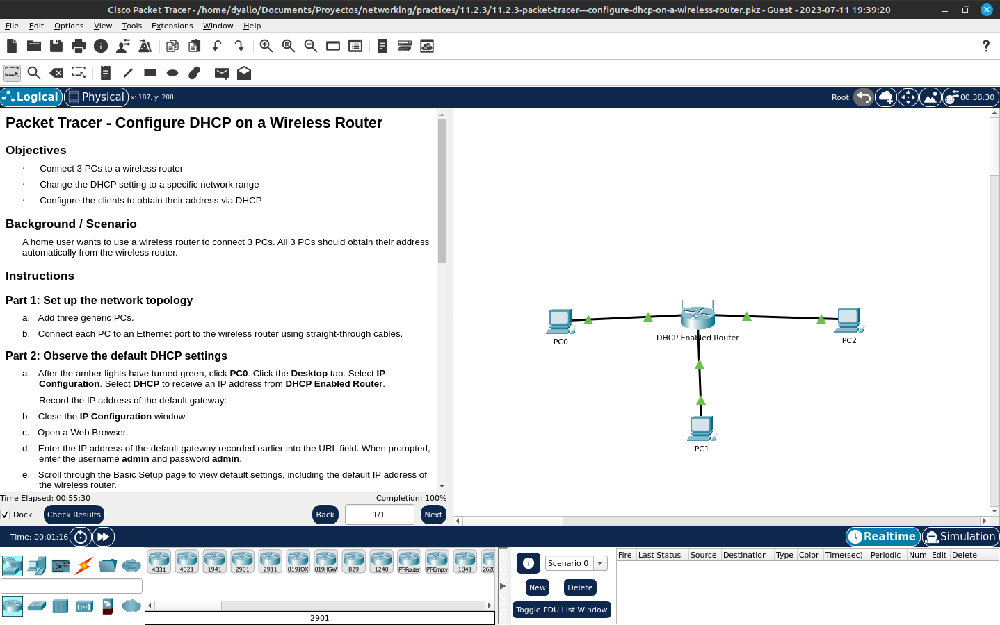

# Configure dhcp on a wireless router

Packet Tracer - Configure DHCP on a Wireless Router

Objectives
·         Connect 3 PCs to a wireless router

·         Change the DHCP setting to a specific network range

·         Configure the clients to obtain their address via DHCP

Background / Scenario
A home user wants to use a wireless router to connect 3 PCs. All 3 PCs should obtain their address automatically from the wireless router.

Instructions
Part 1: Set up the network topology
a.     Add three generic PCs.

b.     Connect each PC to an Ethernet port to the wireless router using straight-through cables.

Part 2: Observe the default DHCP settings
a.     After the amber lights have turned green, click PC0. Click the Desktop tab. Select IP Configuration. Select DHCP to receive an IP address from DHCP Enabled Router.

Question:
Record the IP address of the default gateway:

b.     Close the IP Configuration window.

c.     Open a Web Browser.

d.     Enter the IP address of the default gateway recorded earlier into the URL field. When prompted, enter the username admin and password admin.

e.     Scroll through the Basic Setup page to view default settings, including the default IP address of the wireless router.

f.      Notice that DHCP is enabled, the starting address of the DHCP range and the range of addresses available to clients.

Part 3: Change the default IP address of the wireless router.
a.     Within the Router IP Settings section, change the IP address to: 192.168.5.1.

b.     Scroll to the bottom of the page and click Save Settings.

c.     If it is done correctly, the web page will display an error message. Close the web browser.

d.     Click IP Configuration to renew the assigned IP address. Click Static. Click DHCP to receive new IP address information from the wireless router.

e.     Open the web browser, enter the IP address 192.168.5.1 in the URL field. When prompted, enter the username admin and password admin.

Part 4: Change the default DHCP range of addresses.
a.     Notice the DHCP Server Start IP Address is updated to the same network as the Router IP.

b.     Change the Starting IP Address from 192.168.5.100 to 192.168.5.126.

c.     Change the Maximum Number of Users to 75.

d.     Scroll to the bottom of the page and click Save Settings. Close the web browser.

e.     Click IP Configuration to renew the assigned IP address. Click Static. Click DHCP to receive new IP address information from the wireless router.

f.      Select Command Prompt. Enter ipconfig.

Question:
Record the IP address for PC0:

Part 5: Enable DHCP on the other PCs.
a.     Click PC1.

b.     Select Desktop tab.

c.     Select IP Configuration.

d.     Click DHCP.

Question:
Record the IP address for PC1:

e.     Close the configuration window.

f.      Enable DHCP on PC2 following the steps for PC1.

Part 6: Verify connectivity
a.     Click PC2 and select the Desktop tab.

b.     Select Command Prompt.

c.     Enter ipconfig at the prompt to view the IP configuration.

d.     At the prompt, enter ping 192.168.5.1 to ping the wireless router.

e.     Enter ping 192.168.5.126 to ping PC0 at the prompt.

f.      At the prompt, enter ping 192.168.5.127 to ping PC1.

g.     The pings to all devices should be successful.

End of document

## Cisco Packet Tracer

