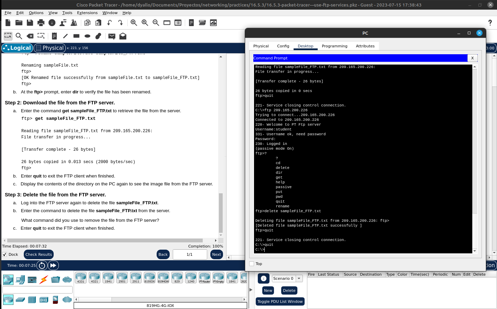

# Activity 16.5.3: FTP



## Objectives
- Upload a file to an FTP server.
- Download a file from an FTP server.

### Background / Scenario
File Transfer Protocol (FTP) is a commonly used application to transfer files between clients and servers on the network. The server is configured to run the service where clients connect, login, and transfer files. FTP uses port 21 as the server command port to create the connection. FTP then uses port 20 for data transfer.

In this activity, you will upload a file to an FTP server. You will also download a file from an FTP server.

### Steps

1. Click on the available computer
2. Enter to **command prompt**
3. connect to the server via FTP

```
ftp <ip>
```

4. Login with the `username` and `password` provided by the instructor
5. Use the `put` command to upload the file to the server
6. `Rename` the file on the server
7. Use the `get` command to download the file from the server
8. Exit the FTP session