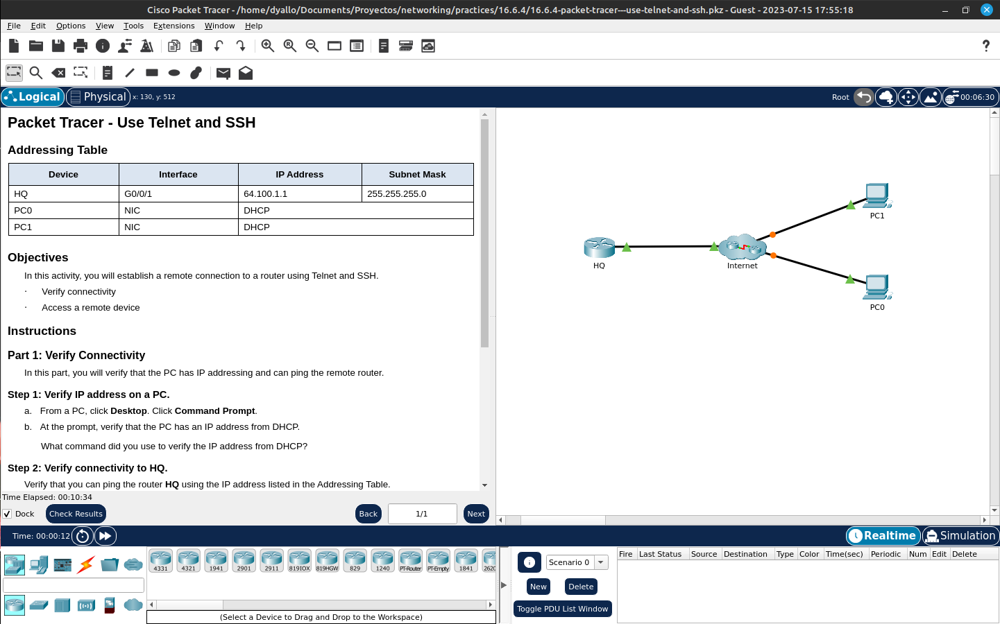

# Activity 16.6.4: Establishing a Remote Connection to a Router Using Telnet and SSH

## Objectives
In this activity, you will establish a remote connection to a router using Telnet and SSH.

Addressing Table

| Device | Interface | IP Address | Subnet Mask |
| ------ | --------- | ---------- | ----------- |
| HQ | G0/0/1 | 64.100.1.1 | 255.255.255.0 |
| PC0 | NIC | DHCP | DHCP |
| PC1 | NIC | DHCP | DHCP |

- Verify connectivity
- Access a remote device

### Steps

1. We enter one of the pcs
2. Go to command prompt
3. We do a `ipconfig` to see the ip address
4. We do a `ping` to the router
5. Try to connect via telnet -> Got rejected because of the router configuration
6. Try to connect via ssh with `ssh -l admin <ip>`
7. Enter the password