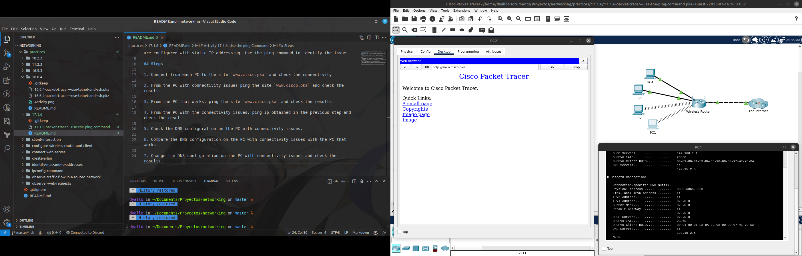

# Activity 17.1.6: Use the ping Command

## Objectives

- Use the `ping` command to identify an incorrect network configuration.

## Background / Scenario
A small business owner learns that some users are unable to access a website. All PCs are configured with static IP addressing. Use the ping command to identify the issue.

## Steps

1. Connect from each PC to the site `www.cisco.pka` and check the connectivity

2. From the PC with connectivity issues ping the site `www.cisco.pka` and check the results.

3. From the PC that works, ping the site `www.cisco.pka` and check the results.

4. From the PC with the connectivity issues, ping ip obtained in the previous step and check the results.

5. Check the DNS configuration on the PC with connectivity issues.

6. Compare the DNS configuration on the PC with connectivity issues with the PC that works.

7. Change the DNS configuration on the PC with connectivity issues and check the results.