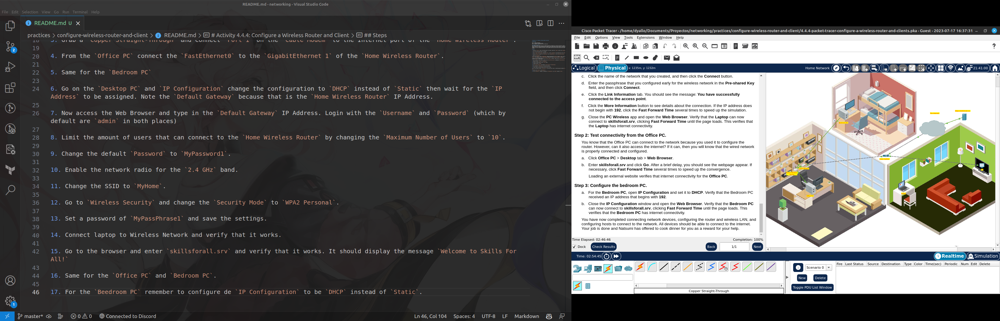

# Activity 4.4.4: Configure a Wireless Router and Client

## Objectives

Part 1: Connect the Devices
Part 2: Configure the Wireless Router
Part 3: Configure IP Addressing and Test Connectivity

## Background / Scenario
Your friend, Natsumi, heard that you are studying networking. She asked you to come over and help her connect her new home to the cable TV network. You need to connect the correct cables to the correct devices, connect devices to a home wireless router, and configure the router to provide IP addresses to network clients. Natsumi also wants you to setup a wireless LAN for her home network, so you will configure that as well. You are confident that this will be an easy process and the network will be setup in no time!

## Steps

1. Connect the `Coaxial` cable to the Cable Splitter. From there, connect the `Coaxial` cable to the `Cable Modem` and `TV`.

2. Turn on the TV and verify that it is working.

3. Grab a `Copper Straight-Through` and Connect `Port 1` on the `Cable Modem` to the Internet port of the `Home Wireless Router`.

4. From the `Office PC` connect the `FastEthernet0` to the `GigabitEthernet 1` of the `Home Wireless Router`.

5. Same for the `Bedroom PC`

6. Go on the `Desktop PC` and `IP Configuration` change the configuration to `DHCP` instead of `Static` then wait for the `IP Address` to be assigned. Note the `Default Gateway` because that is the `Home Wireless Router` IP Address.

7. Now access the Web Browser and type in the `Default Gateway` IP Address. Login with the `Username` and `Password` (which by default are `admin` in both places)

8. Limit the amount of users that can connect to the `Home Wireless Router` by changing the `Maximum Number of Users` to `10`.

9. Change the default `Password` to `MyPassword1`.

10. Enable the network radio for the `2.4 GHz` band.

11. Change the SSID to `MyHome`.

12. Go to `Wireless Security` and change the `Security Mode` to `WPA2 Personal`.

13. Set a password of `MyPassPhrase1` and save the settings.

14. Connect laptop to Wireless Network and verify that it works.

15. Go to the browser and enter `skillsforall.srv` and verify that it works. It should display the message `Welcome to Skills For All!`

16. Same for the `Office PC` and `Bedroom PC`.

17. For the `Beedroom PC` remember to configure de `IP Configuration` to be `DHCP` instead of `Static`.