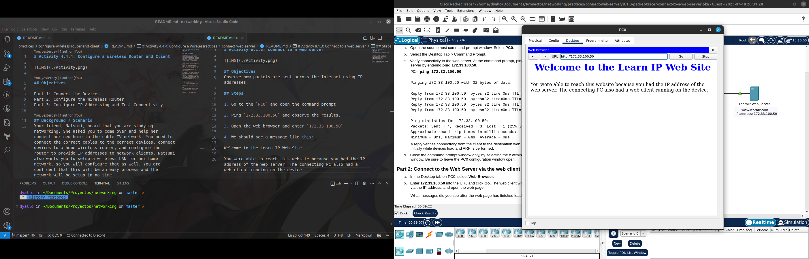

# Activity 8.1.3: Connect to a web server

## Objectives
Observe how packets are sent across the Internet using IP addresses.

## Steps

1. Go to the `PC0` and open the command prompt.

2. Ping `172.33.100.50` and observe the results.

3. Open the web browser and enter `172.33.100.50`

4. We should see a message like this:

Welcome to the Learn IP Web Site

You were able to reach this website because you had the IP address of the web server. The connecting PC also had a web client running on the device.