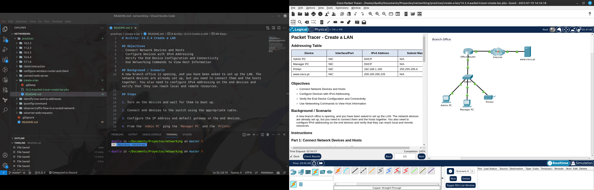

# Acvitiy: 14.3.4 Create a LAN

## Objectives
- Connect Network Devices and Hosts
- Configure Devices with IPv4 Addressing
- Verify the End Device Configuration and Connectivity
- Use Networking Commands to View Host Information

## Background / Scenario
A new branch office is opening, and you have been asked to set up the LAN. The network devices are already set up, but you need to connect them and the hosts together. You also need to configure IPv4 addressing on the end devices and verify that they can reach local and remote resources.

## Steps

1. Turn on the devices and wait for them to boot up.

2. Connect end devices to the switch using the appropriate cable.

3. Configure the IP address and default gateway on the end devices.

4. From the `Admin PC` ping the `Manager PC` and the `Printer`

5. Check connectivity on all devices using the `ping` command.

6. Check using the Web Browser to enter the ip address of the server and verify that the web page is displayed.

7. Enter by using the URL `www.cisco.pt` instead of the ip address and verify that the web page is displayed.

8. Remember to check the `Addressing Table` at the top.

ADMIN PC - DHCP
MANAGER PC - DHCP
Printer - Static IP
Server - Static IP