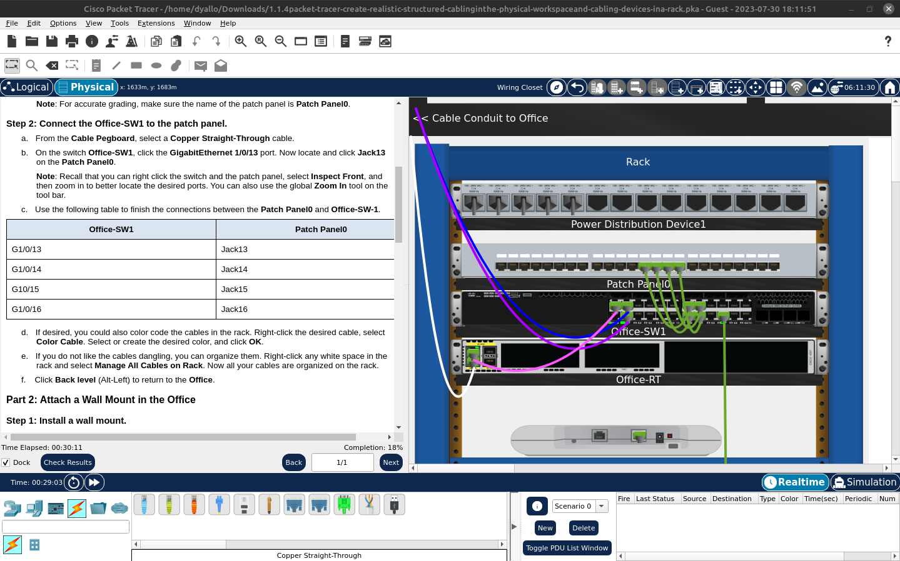
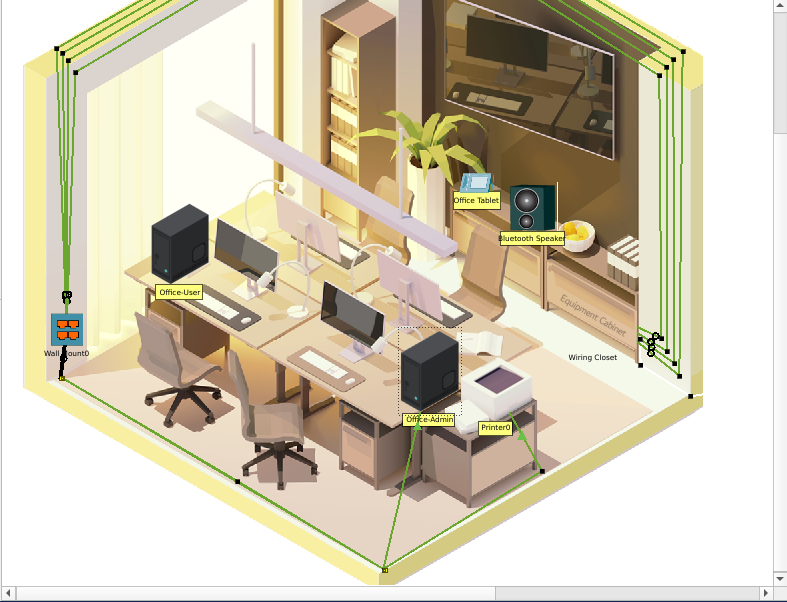
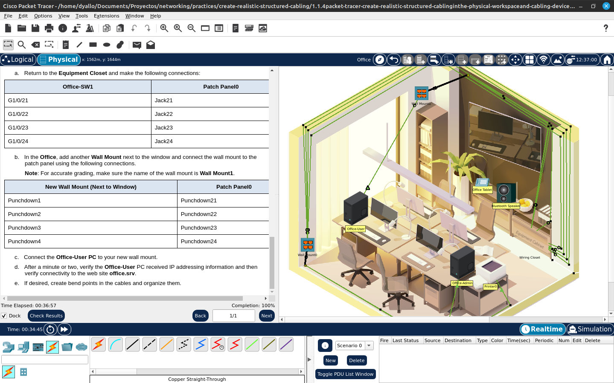

# Activity 1.1.4: Create a realistic structured cabling

## Objectives
In this activity, you will install a patch panel and a wall mount. You will then use these to connect network devices in the office to the equipment in the wiring closet.

Part 1: Install a Patch Panel in the Wiring Closet
Part 2: Attach a Wall Mount in the Office
Part 3: Connect an Additional Wall Mount and Cables

## Required Resources
- Latest Packet Tracer version

## Steps

1 - Install a patch panel in the Rack
2 - Connect the Office-SW1 to the patch panel

2.1 - Attach a Wall Mount in the Office

3. Connect an Additional Wall Mount and Cables

