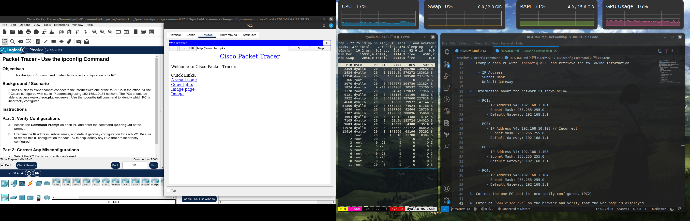

# Activity: 17.1.3 ipconfig Command

## Objectives

Use the ipconfig command to identify incorrect configuration on a PC.

## Background / Scenario
A small business owner cannot connect to the internet with one of the four PCs in the office. All the PCs are configured with static IP addressing using 192.168.1.0 /24 network. The PCs should be able to access www.cisco.pka webserver. Use the ipconfig /all command to identify which PC is incorrectly configured.

## Steps

1. Example each PC with `ipconfig all` and retrieve the following information:

    - IP Address
    - Subnet Mask
    - Default Gateway

2. Information about the network is shown below:

    - PC1:
        - IP Address V4: 192.168.1.101
        - Subnet Mask: 255.255.255.0
        - Default Gateway: 192.168.1.1
    
    - PC2:
        - IP Address V4: 192.168.10.102 // Incorrect
        - Subnet Mask: 255.255.255.0
        - Default Gateway: 192.168.1.1
    
    - PC3:
        - IP Address V4: 192.168.1.103
        - Subnet Mask: 255.255.255.0
        - Default Gateway: 192.168.1.1
    
    - PC4:
        - IP Address V4: 192.168.1.104
        - Subnet Mask: 255.255.255.0
        - Default Gateway: 192.168.1.1
    
3. Correct the one PC that is incorrectly configured. (PC2)

4. Enter at `www.cisco.pka` on the browser and verify that the web page is displayed.